### **Resolución Detallada del Proyecto: Sistema de Gestión de Versiones con Pilas**  
**Objetivo:** Implementar un sistema de control de versiones simplificado (al estilo Git) utilizando pilas para manejar `undo`, `redo`, y branches.  

---

## **Solución Completa**  

### **1. Estructura Base del Sistema**  
```python  
class VersionControl:  
    def __init__(self):  
        # Pilas para el historial y rehacer  
        self.historial = []          # Versiones anteriores (para undo)  
        self.historial_redo = []     # Versiones deshechas (para redo)  
        self.documento_actual = ""   # Contenido actual del documento  
        self.branches = {            # Branches como diccionario de pilas  
            "main": [],  
            "develop": []  
        }  
        self.branch_actual = "main"  # Branch por defecto  

    def guardar_version(self, texto):  
        """Guarda una nueva versión del documento."""  
        # Guardar el estado actual en el historial  
        self.historial.append((self.branch_actual, self.documento_actual))  
        self.documento_actual = texto  
        self.historial_redo = []     # Limpiar redo al hacer un nuevo cambio  

    def deshacer(self):  
        """Revierte a la versión anterior."""  
        if self.historial:  
            branch, texto = self.historial.pop()  
            self.historial_redo.append((self.branch_actual, self.documento_actual))  
            self.documento_actual = texto  
            self.branch_actual = branch  

    def rehacer(self):  
        """Reaplica la versión deshecha."""  
        if self.historial_redo:  
            branch, texto = self.historial_redo.pop()  
            self.historial.append((self.branch_actual, self.documento_actual))  
            self.documento_actual = texto  
            self.branch_actual = branch  

    def cambiar_branch(self, nombre_branch):  
        """Cambia a otro branch, creándolo si no existe."""  
        if nombre_branch not in self.branches:  
            self.branches[nombre_branch] = []  
        self.historial.append((self.branch_actual, self.documento_actual))  
        self.branch_actual = nombre_branch  
        self.documento_actual = self.branches[nombre_branch][-1] if self.branches[nombre_branch] else ""  

    def fusionar_branch(self, origen, destino):  
        """Fusiona los cambios de un branch a otro."""  
        if origen in self.branches and destino in self.branches:  
            texto_fusionado = self.branches[destino][-1] + "\n" + self.branches[origen][-1]  
            self.branches[destino].append(texto_fusionado)  
            self.documento_actual = texto_fusionado  
            self.historial.append((destino, texto_fusionado))  

    def mostrar_estado(self):  
        """Muestra el estado actual del documento y branch."""  
        print(f"Branch: {self.branch_actual}\nDocumento:\n{self.documento_actual}")  
```  

---

### **2. Ejemplo de Uso**  
```python  
# Inicializar el sistema  
vc = VersionControl()  

# Guardar versiones en el branch main  
vc.guardar_version("Versión 1 en main")  
vc.guardar_version("Versión 2 en main")  
vc.mostrar_estado()  
# Output:  
# Branch: main  
# Documento: Versión 2 en main  

# Deshacer el último cambio  
vc.deshacer()  
vc.mostrar_estado()  
# Output:  
# Branch: main  
# Documento: Versión 1 en main  

# Rehacer el cambio  
vc.rehacer()  
vc.mostrar_estado()  
# Output:  
# Branch: main  
# Documento: Versión 2 en main  

# Crear y cambiar a un nuevo branch  
vc.cambiar_branch("develop")  
vc.guardar_version("Versión 1 en develop")  
vc.mostrar_estado()  
# Output:  
# Branch: develop  
# Documento: Versión 1 en develop  

# Fusionar develop en main  
vc.cambiar_branch("main")  
vc.fusionar_branch("develop", "main")  
vc.mostrar_estado()  
# Output:  
# Branch: main  
# Documento: Versión 2 en main  
# Versión 1 en develop  
```  

---

### **3. Explicación Paso a Paso**  

#### **a) Manejo de Historial con Pilas**  
- **`historial`:** Almacena tuplas `(branch, texto)` cada vez que se guarda una versión.  
- **`historial_redo`:** Guarda las versiones deshechas para permitir `rehacer`.  

#### **b) Branches como Pilas Independientes**  
- Cada branch es una clave en el diccionario `branches`, cuyo valor es una pila de versiones.  
- **`cambiar_branch`:** Guarda el estado actual antes de cambiar y carga el último estado del nuevo branch.  

#### **c) Fusión de Branches**  
- **`fusionar_branch`:** Concatena el contenido del branch `origen` al `destino` y actualiza el historial.  

---

### **4. Diagrama de Flujo**  

```mermaid  
graph TD  
    A[Guardar Versión] --> B[Apilar en historial]  
    B --> C[Limpiar historial_redo]  
    D[Deshacer] --> E[Apilar en historial_redo]  
    E --> F[Desapilar de historial]  
    G[Rehacer] --> H[Apilar en historial]  
    H --> I[Desapilar de historial_redo]  
```  


---

### **5. Posibles Mejoras**  
1. **Metadata:** Añadir fecha, autor, o mensaje de commit a cada versión.  
   ```python  
   self.historial.append((branch, texto, datetime.now(), "Autor"))  
   ```  
2. **Conflictos de Fusión:** Implementar detección de conflictos (ej: si ambas branches modifican la misma línea).  
3. **Persistencia:** Guardar el estado en un archivo JSON para recuperarlo posteriormente.  

--- 

**¡Sistema listo!** Los estudiantes pueden expandirlo con nuevas funcionalidades o integrarlo en un proyecto mayor. ¿Qué otra característica te gustaría añadir? 😊 